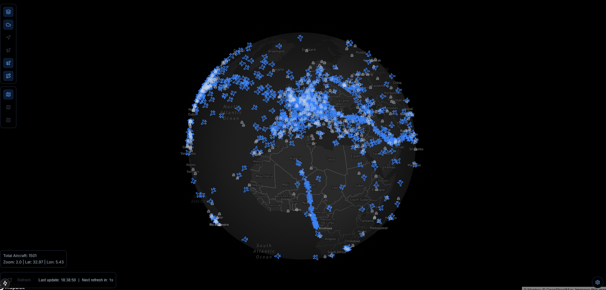

# Real-Time Flight Tracker with Weather Overlay

A sophisticated real-time flight tracking application that combines VATSIM flight data with weather information, providing a comprehensive aviation monitoring experience.

## 🌟 Features

### Flight Tracking
- Real-time aircraft position tracking using VATSIM data
- Flight path visualization with curved great circle routes
- Aircraft information display (callsign, altitude, speed, heading)
- Ground traffic visualization
- Flight plan routes with departure/arrival information
- Aircraft following mode

### Weather System
- METAR data display for airports
  - Temperature, wind, visibility, and pressure information
  - Flight category indicators (VFR, MVFR, IFR, LIFR)
  - Raw METAR text and decoded information
- Weather visualization layers:
  - METAR stations with conditions
  - Weather radar overlay
  - Wind barbs showing direction and speed
  - Weather fronts visualization

### Map Features
- Multiple map styles (Dark, Light, Satellite, Terrain)
- 3D building visualization
- Terrain elevation data
- Customizable map labels
- Day/Night mode
- Airport information overlay

## 🛠️ Technologies

### Frontend
- **React 19** with TypeScript
- **Next.js 15** for server-side rendering and API routes
- **Tailwind CSS** for styling
- **Mapbox GL JS** for map rendering
- **Zustand** for state management
- **React Map GL** for map components
- **Lucide Icons** for UI icons
- **ShadcnUI** for UI components

### Backend & Data
- **Next.js API Routes** for backend functionality
- **Redis** for caching weather and flight data
- **VATSIM API** for real-time flight data
- **CheckWX/VATSIM Weather API** for METAR information

### Development Tools
- TypeScript for type safety
- ESLint for code linting
- Prettier for code formatting
- Husky for git hooks
- Jest for testing

## 🏗️ Architecture

### Data Flow
1. Real-time flight data fetched from VATSIM
2. Weather data cached in Redis
3. Client-side state managed with Zustand
4. Server-side caching for API responses
5. WebSocket updates for real-time position changes

### Key Components
- `MapView`: Main map component with layers
- `WeatherOverlay`: Weather visualization system
- `PlaneMarker`: Aircraft visualization
- `FlightInfo`: Flight information panel
- `WeatherControls`: Weather layer controls

## 🚀 Performance Optimizations

- Redis caching for weather data
- Memoized React components
- Efficient map layer rendering
- Debounced API calls
- Lazy loading of weather overlays

## 🔧 Configuration

The application can be configured through various environment variables and settings:
- Map styles and default view
- Update intervals for data fetching
- Cache durations
- Weather overlay options

## 🤝 Contributing

Contributions are welcome! Please read our [Contributing Guide](CONTRIBUTING.md) for details on our code of conduct and the process for submitting pull requests.

## 📝 License

This project is licensed under the MIT License - see the [LICENSE](LICENSE) file for details.

## 🙏 Acknowledgments

- VATSIM for providing flight data
- Mapbox for mapping technology
- CheckWX for weather data
- Open source community for various tools and libraries

## 🔮 Future Plans

- [ ] Add historical flight path playback
- [ ] Implement additional weather data sources
- [ ] Add flight plan filing capability
- [ ] Enhance 3D visualization
- [ ] Add voice communication features

## 📞 Contact

Marceli Borowczak - [@marceliborowczak](https://twitter.com/marceliborowczak) - marceliborowczak@gmail.com

Project Link: [https://github.com/Gravgor/vatsim-msfs-companion](https://github.com/Gravgor/vatsim-msfs-companion)

---

Made with ❤️ by Marceli Borowczak
